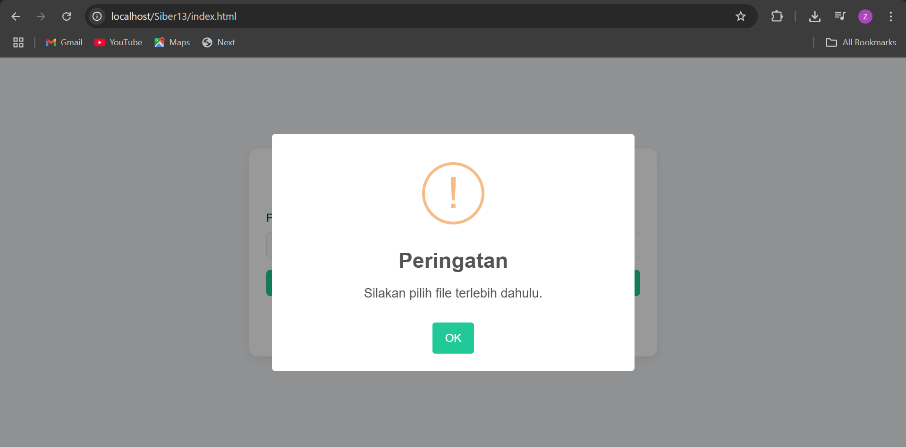

# Proyek Web Upload

Ini adalah proyek aplikasi web sederhana yang berfungsi untuk mengunggah, melihat, mengunduh, dan menghapus file.

---

Berikut adalah dokumentasi visual.

### 1. Halaman Utama

### 2. Notifikasi Peringatan

### 3. Priview File PDF

### 4. Preview File Foto

### 5. Hasil Unggah

### 6. Hasil Unduh

### 7. Hasil Delete

